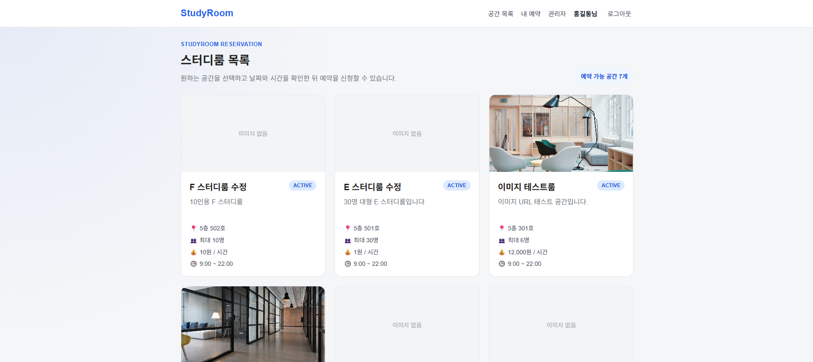
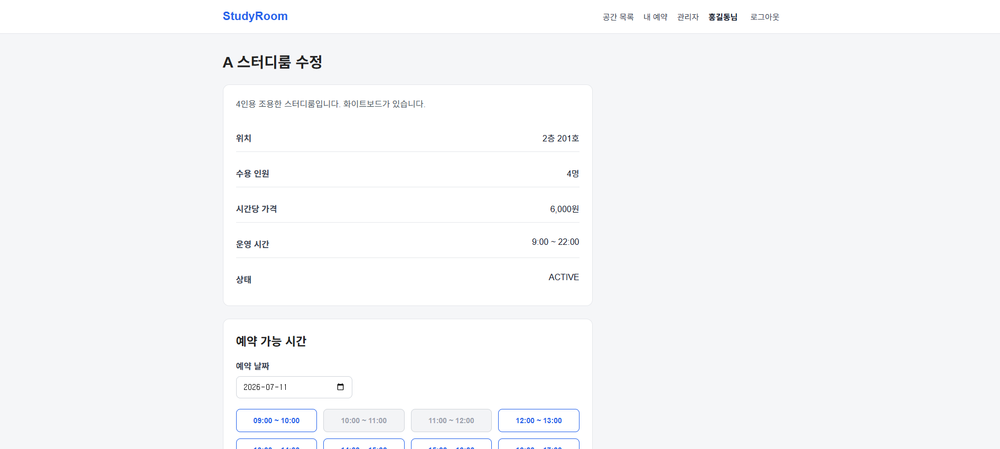
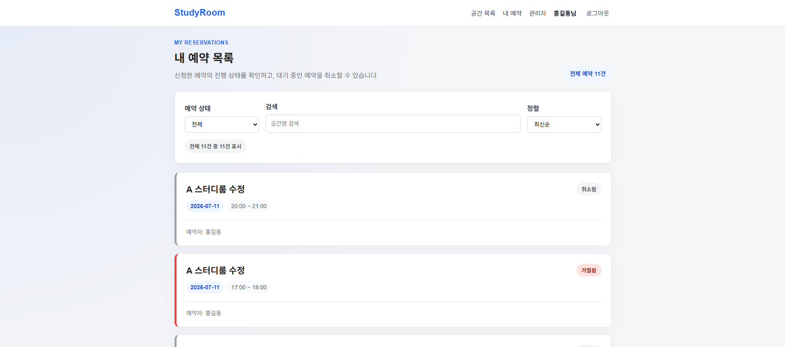
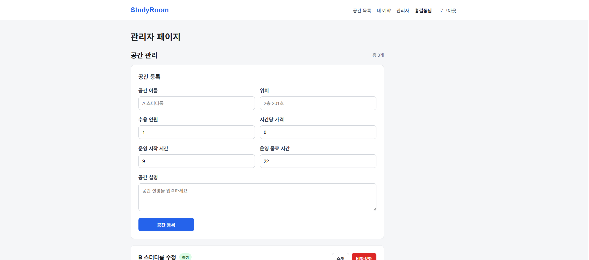
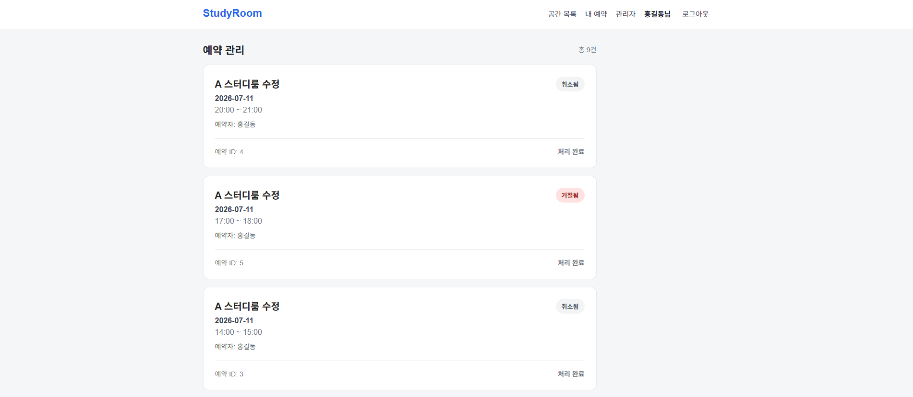

# StudyRoom Reservation

스터디룸 예약을 위한 웹 애플리케이션입니다.  
사용자는 스터디룸 목록을 조회하고 날짜와 시간을 선택해 예약을 신청할 수 있으며, 관리자는 공간을 등록/수정/활성화/비활성화하고 예약을 승인 또는 거절할 수 있습니다.

---

## 프로젝트 특징

- JWT 기반 로그인 및 인증 처리
- Spring Security를 이용한 사용자/관리자 권한 분리
- 401 Unauthorized / 403 Forbidden 응답 분리
- BusinessException과 ErrorCode 기반의 비즈니스 예외 처리
- 예약 시간 중복 방지 로직 구현
- 예약 가능 시간대 조회 기능 구현
- 관리자 공간 등록/수정/활성화/비활성화 기능 구현
- React API 호출 모듈 분리
- 관리자 페이지 컴포넌트 분리
- 프론트엔드 API URL 환경변수 분리

---

## 프로젝트 개요

이 프로젝트는 Spring Boot 기반 REST API 서버와 React 기반 프론트엔드로 구성된 스터디룸 예약 시스템입니다.

주요 목표는 다음과 같습니다.

- JWT 기반 로그인/인증 구현
- 사용자와 관리자 권한 분리
- 스터디룸 공간 관리
- 날짜/시간 기반 예약 신청
- 중복 예약 방지
- 관리자 예약 승인/거절 처리
- React 프론트엔드와 Spring Boot 백엔드 연동

---

## 기술 스택

### Backend

- Java 17
- Spring Boot
- Spring Security
- JWT
- Spring Data JPA
- MySQL
- Swagger / Springdoc OpenAPI

### Frontend

- React
- Vite
- React Router DOM
- Axios
- CSS

### Tools

- STS4
- VS Code
- Postman
- MySQL
- Swagger UI
- Git / GitHub

---

## 주요 기능

### 사용자 기능

- 회원가입
- 로그인
- 로그아웃
- 스터디룸 목록 조회
- 스터디룸 상세 조회
- 날짜별 예약 가능 시간 조회
- 시간 선택 후 예약 신청
- 내 예약 목록 조회
- 예약 취소

### 관리자 기능

- 관리자 페이지 접근 제한
- 전체 예약 목록 조회
- 예약 승인
- 예약 거절
- 전체 공간 목록 조회
- 공간 등록
- 공간 수정
- 공간 활성화
- 공간 비활성화

### 공통 기능

- JWT 기반 인증
- 사용자 / 관리자 권한 분리
- React 보호 라우트 적용
- 공통 에러 응답 처리
- Validation 처리
- Swagger API 문서화
- CORS 설정

---

## 화면 미리보기

### 공간 목록



### 공간 상세 및 예약



### 내 예약 목록



### 관리자 공간 관리



### 관리자 예약 관리



---
## 프로젝트 구조

```text
studyroom-reservation
├── src/main/java/com/studyroom/reservation
│   ├── auth
│   ├── user
│   ├── room
│   ├── reservation
│   ├── admin
│   ├── security
│   ├── config
│   └── common
│
├── src/main/resources
│   ├── application.yml             # local only, git ignored
│   └── application-example.yml
│
├── frontend
│   ├── src
│   │   ├── api
│   │   ├── components
│   │   ├── pages
│   │   ├── routes
│   │   ├── main.jsx
│   │   └── index.css
│   └── package.json
│
├── pom.xml
└── README.md
```

---

## API 목록

### Auth

| Method | URL | 설명 |
|---|---|---|
| POST | `/api/auth/signup` | 회원가입 |
| POST | `/api/auth/login` | 로그인 |

### User

| Method | URL | 설명 |
|---|---|---|
| GET | `/api/users/me` | 내 정보 조회 |

### Room

| Method | URL | 설명 |
|---|---|---|
| GET | `/api/rooms` | 사용자 공간 목록 조회 |
| GET | `/api/rooms/{roomId}` | 공간 상세 조회 |
| GET | `/api/rooms/{roomId}/reservations?date=YYYY-MM-DD` | 특정 날짜 예약 현황 조회 |
| GET | `/api/rooms/{roomId}/available-times?date=YYYY-MM-DD` | 특정 날짜 예약 가능 시간 조회 |

### Reservation

| Method | URL | 설명 |
|---|---|---|
| POST | `/api/reservations` | 예약 신청 |
| GET | `/api/reservations/me` | 내 예약 목록 조회 |
| PATCH | `/api/reservations/{reservationId}/cancel` | 예약 취소 |

### Admin Room

| Method | URL | 설명 |
|---|---|---|
| GET | `/api/admin/rooms` | 관리자 전체 공간 목록 조회 |
| POST | `/api/admin/rooms` | 공간 등록 |
| PUT | `/api/admin/rooms/{roomId}` | 공간 수정 |
| PATCH | `/api/admin/rooms/{roomId}/active` | 공간 활성화 |
| PATCH | `/api/admin/rooms/{roomId}/inactive` | 공간 비활성화 |

### Admin Reservation

| Method | URL | 설명 |
|---|---|---|
| GET | `/api/admin/reservations` | 관리자 전체 예약 목록 조회 |
| PATCH | `/api/admin/reservations/{reservationId}/approve` | 예약 승인 |
| PATCH | `/api/admin/reservations/{reservationId}/reject` | 예약 거절 |

---

## 핵심 비즈니스 로직

### 예약 중복 방지

같은 공간, 같은 날짜에서 `PENDING` 또는 `APPROVED` 상태의 예약과 시간이 겹치는 경우 예약 신청을 차단합니다.

```text
기존 예약 시작 시간 < 새 예약 종료 시간
AND
기존 예약 종료 시간 > 새 예약 시작 시간
```

예시:

```text
기존 예약: 10:00 ~ 12:00
새 예약: 11:00 ~ 13:00
→ 중복 예약으로 차단

기존 예약: 10:00 ~ 12:00
새 예약: 12:00 ~ 14:00
→ 중복이 아니므로 예약 가능
```

### 예약 가능 시간 계산

공간의 운영 시작 시간과 종료 시간을 기준으로 1시간 단위 시간표를 생성합니다.

- 예약 가능한 시간: `available: true`
- 이미 예약된 시간: `available: false`
- 지난 시간: `available: false`
- 비활성화된 공간: 모든 시간 `available: false`

### 공간 비활성화

공간을 비활성화하면 사용자 공간 목록에는 표시되지 않습니다.  
다만 기존 예약 현황 조회는 가능하며, 새 예약 신청은 차단됩니다.

### 권한 제어

- 일반 사용자: 공간 조회, 예약 신청, 내 예약 조회, 예약 취소 가능
- 관리자: 공간 관리, 전체 예약 조회, 예약 승인/거절 가능

---

## 실행 방법

### Backend 실행

프로젝트 루트에서 실행합니다.

```bash
mvn spring-boot:run
```

또는 STS4에서 Spring Boot 애플리케이션을 실행합니다.

### Frontend 환경변수 설정

`frontend/.env.example` 파일을 참고하여 `frontend/.env` 파일을 생성합니다.

```env
VITE_API_BASE_URL=http://localhost:8095
```

### Frontend 실행

```bash
cd frontend
npm install
npm run dev
```

### Frontend 빌드 후 Spring Boot에 포함하기

`frontend/package.json`에는 다음과 같은 통합 빌드용 스크립트를 추가했습니다.

```json
"build:copy": "vite build && xcopy dist\\* ..\\src\\main\\resources\\static\\ /E /H /Y"
```

React 빌드 결과를 Spring Boot의 static 리소스 폴더로 복사할 수 있습니다.

```bash
cd frontend
npm run build:copy
```

위 명령어는 React 프로젝트를 빌드한 뒤, 생성된 dist 파일들을 아래 경로로 복사합니다.

src/main/resources/static

이후 프로젝트 루트에서 Spring Boot jar 파일을 빌드합니다.

```bash
cd ..
mvn clean package
```

jar 실행:

```bash
java -jar target/reservation-0.0.1-SNAPSHOT.jar
```

실행 후 아래 주소로 접속하면 React 화면과 백엔드 API를 같은 서버에서 확인할 수 있습니다.

http://localhost:8095


---

## 접속 주소

| 구분 | URL |
|---|---|
| Frontend | `http://localhost:5173` |
| Backend | `http://localhost:8095` |
| Swagger UI | `http://localhost:8095/swagger-ui.html` |

---

## 테스트 계정 설정

회원가입을 통해 일반 사용자 계정을 생성할 수 있습니다.

관리자 계정은 회원가입 후 DB에서 role 값을 변경하여 테스트할 수 있습니다.

```sql
UPDATE users
SET role = 'ADMIN'
WHERE email = 'admin@example.com';
```

권한 변경 후에는 다시 로그인해야 새 JWT 토큰에 관리자 권한이 반영됩니다.

---

## 주요 화면 흐름

### 사용자 예약 흐름

```text
회원가입
→ 로그인
→ 공간 목록 조회
→ 공간 상세 조회
→ 날짜 선택
→ 예약 가능 시간 조회
→ 시간 선택
→ 예약 신청
→ 내 예약 목록 조회
→ 예약 취소
```

### 관리자 관리 흐름

```text
관리자 로그인
→ 관리자 페이지 접근
→ 전체 예약 조회
→ 예약 승인 / 거절
→ 전체 공간 조회
→ 공간 등록 / 수정
→ 공간 활성화 / 비활성화
```

---

## 구현 완료 항목

### Backend

- 회원가입 API
- 로그인 API
- JWT 발급 및 검증
- Spring Security 권한 설정
- 공간 등록/조회/수정/활성화/비활성화 API
- 예약 신청 API
- 예약 중복 방지 로직
- 내 예약 조회 API
- 예약 취소 API
- 관리자 예약 승인/거절 API
- 예약 가능 시간 조회 API
- Swagger 문서화
- 공통 예외 처리
- BusinessException / ErrorCode 기반 비즈니스 예외 처리
- 인증 실패와 권한 없음에 대한 401 / 403 응답 분리

### Frontend

- React Router 설정
- 공통 Layout/Header 구성
- 로그인/회원가입 화면
- JWT 토큰 저장 및 자동 Authorization 처리
- 로그인 상태별 Header 메뉴 분기
- 보호 라우트 적용
- 공간 목록 화면
- 공간 상세 화면
- 예약 가능 시간 조회 화면
- 예약 신청 기능
- 내 예약 목록 및 취소 기능
- 관리자 예약 관리 화면
- 관리자 공간 관리 화면
- Axios Interceptor 기반 401 / 403 공통 처리
- API 호출 모듈 분리
- 관리자 페이지 컴포넌트 분리
- 환경변수를 통한 API URL 관리
- 관리자 공간 관리 / 예약 관리 탭 UI 구현

---

## 향후 개선 사항

- 화면 디자인 고도화
- 예약 검색/필터 기능 추가
- 공간 이미지 업로드 기능 추가
- 예약 승인/거절 사유 입력 기능 추가
- Refresh Token 적용
- 배포 환경 구성
- Docker 적용
- GitHub Actions 기반 CI/CD 구성

---

## 개발 목적

이 프로젝트는 Spring Boot와 React를 활용한 풀스택 웹 애플리케이션 구현 경험을 정리하기 위한 포트폴리오 프로젝트입니다.

JWT 인증, 권한 제어, REST API 설계, 예약 중복 방지 로직, 관리자 기능, React 기반 화면 구현을 중심으로 개발했습니다.